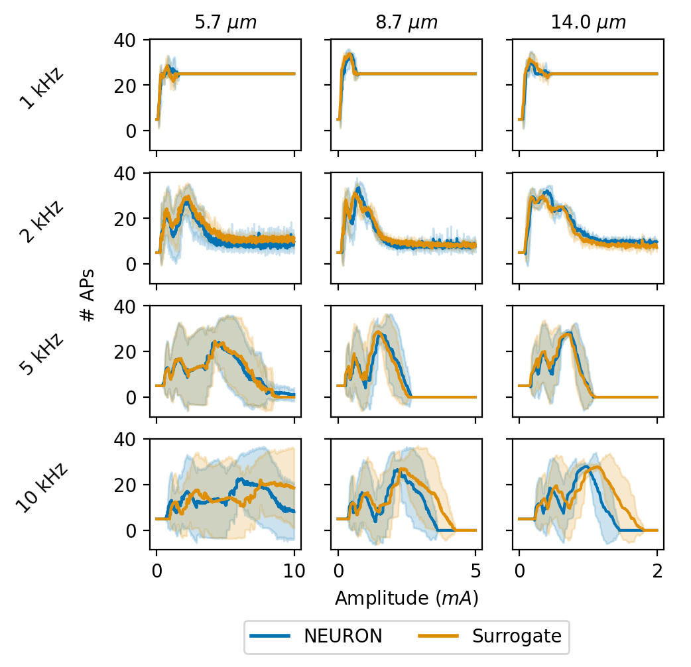

# Simulate kHz frequency sinusoidal stimulation

> [!IMPORTANT]
> Visualization requires `pandas` and `seaborn`. Install with `pip install pandas seaborn`.

We provide an example script for simulating high frequency stimulation. Execute with:

```bash
> python run_khz.py
```

After a few minutes you should see:

<div align="center">
  
</div>

Congratulations, you have successfully simulated ~50,000 axons, a cumulative simulated time of ~1.5 hrs that may otherwise have taken a few months!