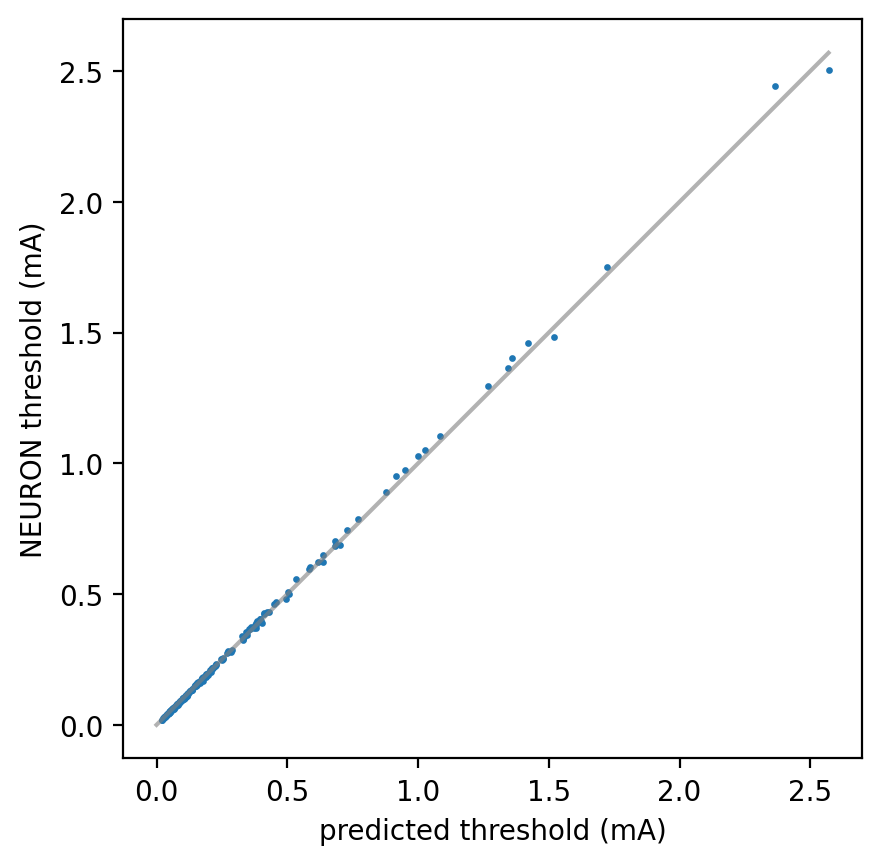
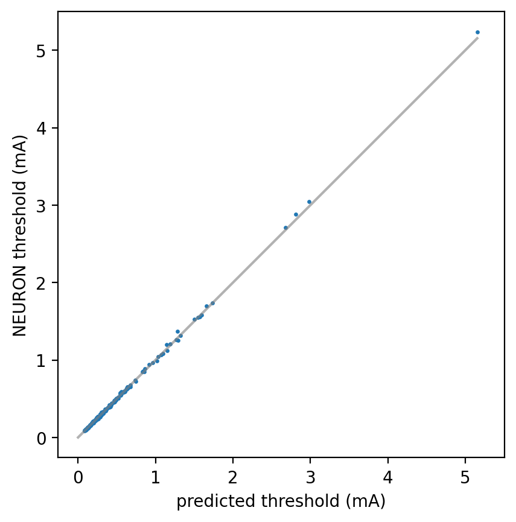

# Thresholding

The basic procedure for running thresholds is:

1. Load surrogate model (useful to set `handle_nan=True` when calling the model constructor).

2. Load / calculate the set of spatiotemporal extracellular potentials corresponding to 'unit' stimulation under each condition you're interested in (fiber diameter x field x stimulus waveform)

> [!IMPORTANT]
> The resulting set of spatiotemporal extracellular potentials must be an array of shape `(n_conditions, n_timesteps, n_nodes)`. For example, if you were calculating thresholds for the same extracellular field distribution for 50 different pulse-widths of monophasic extracellular cathodic stimulation, with a simulation duration of 5 ms and dt=0.005 ms and each fiber has 51 nodes, the array would have dimensions `(50, 1000, 51)`. If you were doing the same but for two fiber diameters, the resulting array would have dimensions `(100, 1000, 51)`, etc.

3. Construct an `axonml.instruments.thresholder.Thresholder` object.

```python
from axonml.instruments.thresholder import Thresholder
# load model, construct field arrays
thresholder = Thresholder(model, field_arrays, fiber_diameters)
```
> [!IMPORTANT]
> `fiber_diameters` can be a float if you're only testing one fiber diameter, or a 1D array `n_conditions` long, corresponding to the fiber diameter for each condition you're testing.


4. Calculate thresholds.

```python
threshold, lb = thresholder.calculate_thresholds()
```

> [!NOTE]
> `calculate_thresholds` returns a 2-tuple, the upper and lower bound for a bisection threshold search. Say we're simulating $t$ timesteps and $n$ nodes. Then let $x \in \mathbb{R}^{t\times n}$ be the spatiotemporal field generated by a unit stimulus amplitude for a given condition (field, fiber diameter, waveform, etc.). The upper bound $b_u$ and lower bound $b_l$ are such that stimulating with $b_u\times x$ generates a propagating action potential and stimulating with $b_l \times x$ does not, and $\frac{b_u - b_l}{b_u} \leq r$, where $r$ is by default 0.01. This may be changed by setting `resolution` when constructing the Thresholder, e.g.:

```python
thresholder = Thresholder(model, field_arrays, fiber_diameters, resolution=0.05)
```

`thresholds.py` provides a full example that you can run. You can run monopolar ImThera or bipolar Livanova stimulation, which you can specify with the `-f` command-line flag. Use the `-v` flag if you want to visualize results with `matplotlib`. E.g., :

```
> python thresholds.py -f imthera (or livanonva) -v
```

Expected output, for Imthera cuff:

<div align="center">
  
</div>

and for Livanova (helical) cuff:


<div align="center">
  
</div>